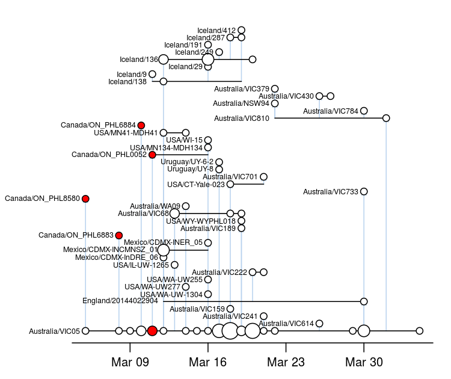

# CoVizu: Real-time visualization of SARS-COV-2 genomic diversity

CoVizu is an open source project to develop a `near real time' SARS-CoV-2 genome analysis and visualization system that highlights potential cases of importation from other countries or ongoing community transmission.

The current mode of visualization employed by CoVizu that we are tentatively referring to as a "beadplot":

### How to read a beadplot:

* Each horizontal line segment represents a unique SARS-CoV-2 genomic sequence variant.  The emergence of a single new mutation in an infection is sufficient to establish a new variant.  A given variant may be observed multiple times as identical genome sequences, where `identity' is loosely defined to accommodate genomes with incomplete coverage and ambiguous base calls.  (Following GISAID's definition of a "complete genome", we require a minimum sequence length of 29,000 nt.)
* Each circle represents one or more cases of a variant that were sampled on a given date.  The size (area) of the circle is proportional to the number of sequences.
* Cases are arranged in chronological order from left to right.
* Vertical lines connect variants that are related by a minimum spanning tree, which gives a *rough* approximation of transmission links.  The variant at the bottom terminus of the vertical line is the putative source.  
* The relative location of variants along the vertical axis does not convey any information.  The variants are sorted with respect to the vertical axis such that ancestral variants are always below their "descendant" variants.

**It is not feasible to reconstruct accurate links using only genomic data.**  However, our objective is to identify population-level events like importations into Canada, not to attribute a transmission to a specific source individual.

## Rationale

There is a rapidly accumulating number of genome sequences of severe acute 
respiratory syndrome coronavirus 2 (SARS-CoV-2) collected at sites around 
the world, predominantly available through the Global Intiative on Sharing 
All Influenza Data (GISAID) database.
The public release of these genome sequences in near real-time is an 
unprecedented resource for molecular epidemiology and public health.
For example, [nextstrain](http://nextstrain.org) has been at the forefront 
of analyzing and communicating the global distribution of SARS-CoV-2 genomic 
variation.

The central feature of [nextstrain](nextstrain.org) is a reconstruction of 
a time-scaled phylogeny (a tree-based model of how infections are related 
by common ancestors back in time).
Geographic locations of samples are mapped onto the tree by colour to 
communicate the global distribution of the pandemic over time.
However, it is not obvious how useful (actionable) information can be best 
extracted from these data, particularly in the context of a regional public 
health authority.

A significant challenge in using a time-scaled tree to visualize the 
evolutionary (and, to some approximation, epidemiological) relationships 
among sampled infections is that most of the image is occupied by 
ancestral lineages whose existence were reconstructed from the observed 
infections.
One of our basic assumptions in developing CoVizu is that ancestral genomes 
are directly sampled --- we think this is not unreasonable given the 
relatively slow rate of molecular evolution in comparison to the virus 
transmission rate.

Another limitation of the tree visualization is that it does not convey 
information about observing the same genome sequence from multiple samples 
over time.
There is no means to differentiate identical sequences in a phylogeny 
because there are no phylogenetically informative sites that separate them.
One could extend the tips of the tree to span the time period of sample 
collection and mark sampled genomes as in the beadplot above.
However, the time scale of sampling identical genomes is relatively short 
compared to the evolutionary history of the virus that is represented by 
the tree.

## Current workflow

1. Sequences from the last 24 hours are bulk downloaded from the GISAID database.  All developers have signed the GISAID data access agreement, and sequences are not being re-distributed.

2. Sequences are aligned pairwise against the SARS-COV-2 reference genome using the short read mapper [minimap2](https://github.com/lh3/minimap2) and a Python wrapper `minimap2.py` that applies the [CIGAR](https://samtools.github.io/hts-specs/SAMv1.pdf) string to each genome to either reconstitute the aligned sequence or extract all differences from the reference. 

3. Genomes are classified into [Pangolin lineages](https://github.com/cov-lineages/pangolin) using the script `pangolearn.py`.

3. A single representative genome is selected for each Pangolin lineage.  We take the most recent sample that pass all of our filtering criteria (<1% uncalled bases, genetic divergence consistent with molecular clock, with all [problematic sites](https://github.com/W-L/ProblematicSites_SARS-CoV2) filtered out).

4. A time-scaled tree is reconstructed using a combination of [fasttree2](http://www.microbesonline.org/fasttree/) and [TreeTime](https://github.com/neherlab/treetime).

5. For all genomes within each lineage, we extract all genetic differences from the reference genome as "features", which provides a highly compact representation of that genome.  We calculate the [symmetric difference](https://en.wikipedia.org/wiki/Symmetric_difference) of each genome to every other genome and cache the result on the filesystem.

6. For each lineage, we generate 100 replicate bootstrap samples of the feature set union to convert the symmetric differences into distance matrices, treating every genetic difference equally (Manhattan distance).  Each distance matrix is used to reconstruct a [neighbor-joining](https://en.wikipedia.org/wiki/Neighbor_joining) tree using [RapidNJ](https://birc.au.dk/software/rapidnj/).

7. For each lineage, a consensus tree is calculated from the set of bootstrap trees and converted into a beadplot.

## Acknowledgements
The development and validation of these scripts was made possible by the labs who have generated and contributed SARS-COV-2 genomic sequence data that is curated and published by [GISAID](https://www.gisaid.org/).  We sincerely thank these labs for making this information available to the public and open science.
