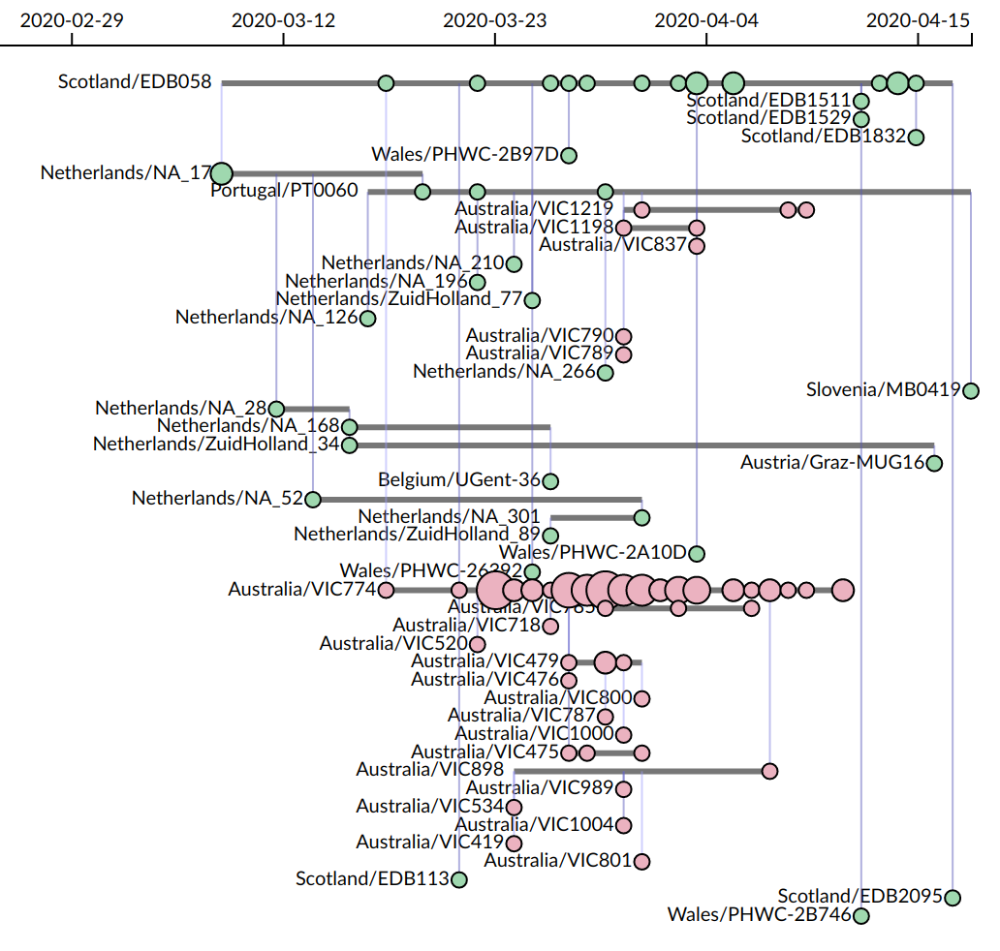

# CoVizu: Real-time visualization of SARS-COV-2 genomic diversity

CoVizu is an open source project to develop a `near real time' SARS-CoV-2 genome analysis and visualization system that highlights potential cases of importation from other countries or ongoing community transmission.

* [Rationale](https://github.com/PoonLab/covizu#rationale)
* [Dependencies](https://github.com/PoonLab/covizu#dependencies)
* [Getting started](https://github.com/PoonLab/covizu#getting-started)
* [Acknowledgements](https://github.com/PoonLab/covizu#acknowledgements)

The current mode of visualization employed by CoVizu that we are tentatively referring to as a "beadplot":

<p align="center">

</p>

### How to read a beadplot:

* Each horizontal line segment represents a unique SARS-CoV-2 genomic sequence variant.  The emergence of a single new mutation in an infection is sufficient to establish a new variant.  A given variant may be observed multiple times as identical genome sequences, where `identity' is loosely defined to accommodate genomes with incomplete coverage and ambiguous base calls.  (Following GISAID's definition of a "complete genome", we require a minimum sequence length of 29,000 nt.)
* Each circle represents one or more cases of a variant that were sampled on a given date.  The size (area) of the circle is proportional to the number of sequences.
* Cases are arranged in chronological order from left to right.
* Vertical lines connect variants that are related by a minimum spanning tree, which gives a *rough* approximation of transmission links.  The variant at the bottom terminus of the vertical line is the putative source.  
* The relative location of variants along the vertical axis does not convey any information.  The variants are sorted with respect to the vertical axis such that ancestral variants are always below their "descendant" variants.

**It is not feasible to reconstruct accurate epidemiological links using only genomic data.**  
However, our objective is to identify population-level events like ongoing community transmission or movement between countries, not to attribute a transmission to a specific individual.


## Rationale

### An enormous number of genomes
There is a rapidly accumulating number of genome sequences of severe acute 
respiratory syndrome coronavirus 2 (SARS-CoV-2) --- as many as thousands 
every day -- that have been collected at sites around the world.  
These data are predominantly available through the Global Intiative on Sharing 
All Influenza Data (GISAID) database.
The public release of these genome sequences in near real-time is an 
unprecedented resource for molecular epidemiology and public health.
For example, [nextstrain](http://nextstrain.org) has been at the forefront 
of analyzing and communicating the global distribution of SARS-CoV-2 genomic 
variation.

Visualizing the entirety of this genome database represents a significant
challenge.  Although it is possible to reconstruct a tree relating all
genome sequences, for example, it is difficult to display the entire tree in a 
meaningful way.

### Trees are limiting
The central feature of [nextstrain](nextstrain.org) is a reconstruction of 
a time-scaled phylogeny (a tree-based model of how infections are related 
by common ancestors back in time).
Geographic locations of samples are mapped onto the tree by colour to 
communicate the global distribution of the pandemic over time.
However, it is not obvious how useful (actionable) information can be best 
extracted from these data, particularly in the context of a regional public 
health authority.

A significant challenge in using a time-scaled tree to visualize the 
evolutionary (and, to some approximation, epidemiological) relationships 
among sampled infections is that most of the image is occupied by 
ancestral lineages whose existence were reconstructed from the observed 
infections.
One of our basic assumptions in developing CoVizu is that ancestral genomes 
are directly sampled --- we think this is not unreasonable given the 
relatively slow rate of molecular evolution in comparison to the virus 
transmission rate.

### A majority of genomes are identical
Another limitation of the tree visualization is that it does not convey 
information about observing the same genome sequence from multiple samples 
over time.
About two-thirds of the SARS-CoV-2 genome sequences in GISAID are identical to
another genome.

There is no means to differentiate identical sequences in a phylogeny 
because there are no phylogenetically informative sites that separate them.
One could extend the tips of the tree to span the time period of sample 
collection and mark sampled genomes as in the beadplot above.
However, the time scale of sampling identical genomes is relatively short 
compared to the evolutionary history of the virus that is represented by 
the tree.

Sampling identical genomes in different locations or over different
points in time from the same location is useful information for public health.
Our primary motivation for developing beadplots was to place greater visual 
emphasis on this information.


## Dependencies
CoVizu is being developed on [Ubuntu Linux](https://ubuntu.com/) and macOS platforms.

* Mozilla [geckodriver](https://github.com/mozilla/geckodriver) v0.26+ (optional for data retrieval)
* [Python](https://www.python.org/) 3.6 or higher, and the following modules:
  * [Selenium](https://github.com/SeleniumHQ/selenium/) version 3.14.1+ (optional for data retrieval)
  * [gotoh2](https://github.com/ArtPoon/gotoh2/) - requires a build environment for C
  * [networkx](https://networkx.github.io/) version 2.3+
  * [BioPython](https://biopython.org/) version 1.7+
* GNU [sed](https://www.gnu.org/software/sed/) stream editor
* [TN93](https://github.com/veg/tn93) v1.0.6
* [R](https://cran.r-project.org/) 3.6+, and the following packages:
  * [igraph](https://igraph.org/r/) version 1.2+
  * [jsonlite](https://cran.r-project.org/web/packages/jsonlite/index.html) version 1.6+
  * [Rtsne](https://cran.r-project.org/web/packages/Rtsne/index.html) version 0.15
* [FastTree2](http://www.microbesonline.org/fasttree/) version 2.1.10+, compiled for [double precision](http://www.microbesonline.org/fasttree/#BranchLen)
* [TreeTime](https://github.com/neherlab/treetime) version 0.7.5+


## Getting started

Our source code is distributed with JSON data files, so you can launch a local 
instance of CoVizu by running the bash script:
```console
Elzar:covizu artpoon$ bash run-server.sh 
Serving HTTP on 127.0.0.1 port 8001 (http://127.0.0.1:8001/) ...
```
and then directing your web browser to `localhost:8001`.
These JSON files are not regularly updated - they are provided for the purpose of front-end
development and demonstration.

The following workflow to generate the JSON files from the database is automated by the bash script `covizu.sh`:

1. Sequences are bulk downloaded from the GISAID database.  All developers have signed the GISAID data access agreement, and sequences are not being re-distributed.

2. Sequences are aligned pairwise against the SARS-COV-2 reference genome using the Procrustean method implemented in [gotoh2](http://github.com/ArtPoon/gotoh2) - see `updater.py`.  This module provides a method that progressively updates an existing alignment file with new sequence records, avoiding the re-alignment of previously released genomes.

3. Sequences are filtered using `filtering.py` for entries that are derived from non-human sources, incomplete genomes, and genomes that contain >5% fully ambiguous base calls (`N`s).  **If you prefer to use your own alignment software, this would be your entry point using a FASTA file as input.**

4. A pairwise genetic distance matrix is generated using [TN93](http://github.com/veg/tn93) - only distances below a cutoff of `0.0001` are recorded to the output file.

5. Identical sequences are collapsed into a small number of variants using the Python script `variants.py`.  Note that this does not require that sequences overlap end-to-end, nor that the overlapping regions are an exact match (accommodating ambiguous base calls, for example).

6. A pairwise TN93 genetic distance matrix is generated for the reduced data set of unique genomic variants.

7. Variants are clustered with respect to the pairwise distance matrix using hierarchical clustering.  A [minimum spanning tree](https://en.wikipedia.org/wiki/Minimum_spanning_tree) is reconstructed for each cluster, and rooted at the variant that is closest to the earliest sampled variant (Wuhan, IPBCAMS-WH-01).  The results are written to [JSON](https://en.wikipedia.org/wiki/JSON) files.

8. Visualizations are generated from the JSON data using the [d3.js](https://en.wikipedia.org/wiki/D3.js) Javascript framework.


## Acknowledgements
CoVizu was made possible by the labs who have generated and contributed SARS-COV-2 genomic sequence data that is curated and published by [GISAID](https://www.gisaid.org/).  We sincerely thank these labs for making this information available to the public and open science.
The development of CoVizu is supported in part by a Project Grant from the [Canadian Institutes of Health Research](https://cihr-irsc.gc.ca/e/193.html) (PJT-156178).
