# Backend documentation

[CoVizu](https://github.com/PoonLab/covizu) is a method for visualizing the genomic diversity of SARS-CoV-2,  comprising a backend for analyzing data, and a frontend for displaying the results of that analysis as interactive animations.
The purpose of this document is to provide a high-level description of the different stages of the backend workflow, which are implemented in the Python script `batch.py`.
Generally, this workflow is made up of the following steps:
1. Data are downloaded from the GISAID database and processed (quality control, filtering; `process_feed`)
2. A time-scaled phylogenetic tree is reconstructed from a subset of genomes each representing a different PANGO lineage (`build_timetree`)
3. Neighbor-joining trees are reconstructed from all samples for each lineage, and converted into a format used for "beadplot" visualizations (`make_beadplots`)

## `process_feed`

The purpose of this step is to download and process data from the GISAID database.
In general, the functions for this step are implemented in the Python script `utils/gisaid_utils.py`.

* `download_feed` - A [xz](https://en.wikipedia.org/wiki/XZ_Utils)-compressed [JSON](https://en.wikipedia.org/wiki/JSON) file is provisioned by the GISAID database for maintaining the CoVizu web app.
For security, the URL and credentials for accessing this data file are stored as environmental variables, and are not present in the source code repository.
This function returns a path to the time-stamped file download.

* `load_gisaid` - 

## `build_timetree`

## `make_beadplots`

